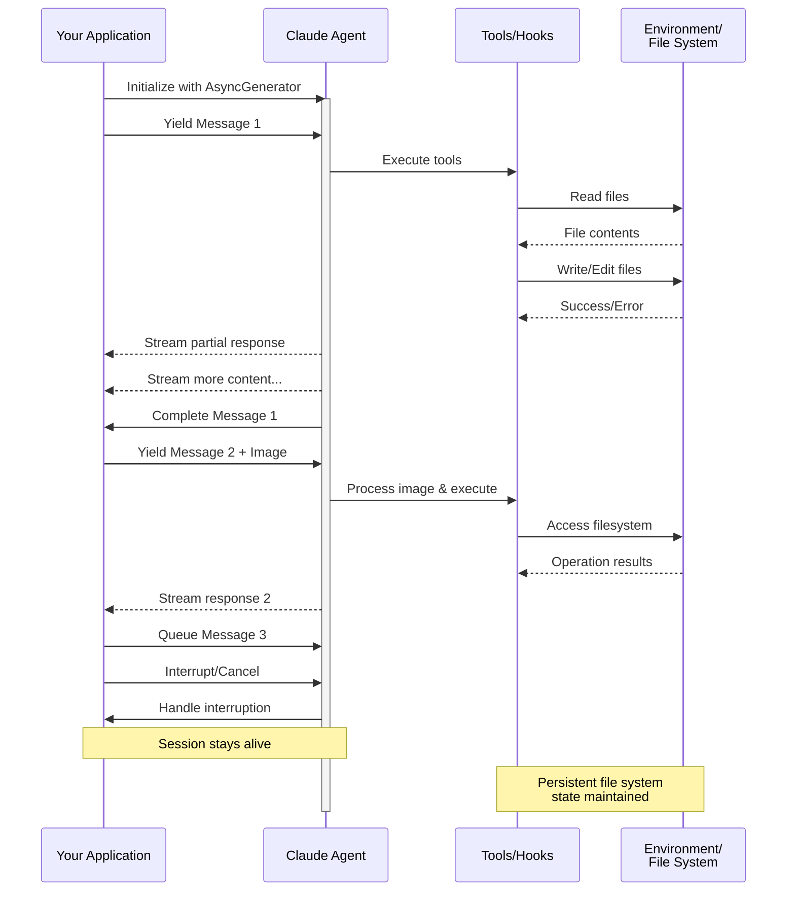

> Nguồn: https://code.claude.com/docs/en/agent-sdk/streaming-vs-single-mode.md
> Tài liệu Claude Code — bản dịch tiếng Việt

# Streaming Input

> Hiểu về hai chế độ đầu vào của Claude Agent SDK và khi nào nên dùng mỗi chế độ

## Tổng quan

Claude Agent SDK hỗ trợ hai chế độ đầu vào riêng biệt để tương tác với agent:

* **Chế độ Streaming Input** (Mặc định & Được khuyến nghị) - Một phiên tương tác, bền vững
* **Chế độ Single Message Input** - Các truy vấn một lần (one-shot) sử dụng trạng thái phiên và khả năng resume

Hướng dẫn này giải thích những khác biệt, lợi ích và trường hợp sử dụng cho mỗi chế độ để giúp bạn chọn cách tiếp cận phù hợp cho ứng dụng của mình.

## Chế độ Streaming Input (Được khuyến nghị)

Chế độ streaming input là cách **được ưu tiên** để sử dụng Claude Agent SDK. Nó cung cấp quyền truy cập đầy đủ vào các khả năng của agent và cho phép các trải nghiệm phong phú, có tính tương tác.

Nó cho phép agent hoạt động như một tiến trình tồn tại lâu dài, tiếp nhận đầu vào của người dùng, xử lý các ngắt (interruption), hiển thị các yêu cầu về quyền, và xử lý việc quản lý phiên.

### Cách hoạt động



### Lợi ích

<CardGroup cols={2}>
  <Card title="Image Uploads" icon="image">
    Đính kèm hình ảnh trực tiếp vào tin nhắn để phân tích và hiểu về hình ảnh
  </Card>

  <Card title="Queued Messages" icon="stack">
    Gửi nhiều tin nhắn được xử lý tuần tự, với khả năng ngắt (interrupt)
  </Card>

  <Card title="Tool Integration" icon="wrench">
    Quyền truy cập đầy đủ vào tất cả các tool và các máy chủ MCP tùy chỉnh trong suốt phiên
  </Card>

  <Card title="Real-time Feedback" icon="lightning">
    Xem phản hồi ngay khi chúng được sinh ra, không chỉ là kết quả cuối cùng
  </Card>

  <Card title="Context Persistence" icon="database">
    Duy trì ngữ cảnh hội thoại qua nhiều lượt một cách tự nhiên
  </Card>
</CardGroup>

### Ví dụ triển khai

<CodeGroup>
  ```typescript TypeScript theme={null}
  import { query, type SDKUserMessage } from "@anthropic-ai/claude-agent-sdk";
  import { readFile } from "fs/promises";

  async function* generateMessages(): AsyncGenerator<SDKUserMessage> {
    // First message
    yield {
      type: "user",
      message: {
        role: "user",
        content: "Analyze this codebase for security issues"
      },
      parent_tool_use_id: null
    };

    // Wait for conditions or user input
    await new Promise((resolve) => setTimeout(resolve, 2000));

    // Follow-up with image
    yield {
      type: "user",
      message: {
        role: "user",
        content: [
          {
            type: "text",
            text: "Review this architecture diagram"
          },
          {
            type: "image",
            source: {
              type: "base64",
              media_type: "image/png",
              data: await readFile("diagram.png", "base64")
            }
          }
        ]
      },
      parent_tool_use_id: null
    };
  }

  // Process streaming responses
  for await (const message of query({
    prompt: generateMessages(),
    options: {
      maxTurns: 10,
      allowedTools: ["Read", "Grep"]
    }
  })) {
    if (message.type === "result" && message.subtype === "success") {
      console.log(message.result);
    }
  }
  ```

  ```python Python theme={null}
  from claude_agent_sdk import (
      ClaudeSDKClient,
      ClaudeAgentOptions,
      AssistantMessage,
      TextBlock,
  )
  import asyncio
  import base64


  async def streaming_analysis():
      async def message_generator():
          # First message
          yield {
              "type": "user",
              "message": {
                  "role": "user",
                  "content": "Analyze this codebase for security issues",
              },
          }

          # Wait for conditions
          await asyncio.sleep(2)

          # Follow-up with image
          with open("diagram.png", "rb") as f:
              image_data = base64.b64encode(f.read()).decode()

          yield {
              "type": "user",
              "message": {
                  "role": "user",
                  "content": [
                      {"type": "text", "text": "Review this architecture diagram"},
                      {
                          "type": "image",
                          "source": {
                              "type": "base64",
                              "media_type": "image/png",
                              "data": image_data,
                          },
                      },
                  ],
              },
          }

      # Use ClaudeSDKClient for streaming input
      options = ClaudeAgentOptions(max_turns=10, allowed_tools=["Read", "Grep"])

      async with ClaudeSDKClient(options) as client:
          # Send streaming input
          await client.query(message_generator())

          # Process responses
          async for message in client.receive_response():
              if isinstance(message, AssistantMessage):
                  for block in message.content:
                      if isinstance(block, TextBlock):
                          print(block.text)


  asyncio.run(streaming_analysis())
  ```
</CodeGroup>

<Note>
  Trong TypeScript SDK, nếu message generator của bạn ném ra lỗi (throw), ví dụ khi một file mà nó đọc bị thiếu, thì stream sẽ kết thúc với một lỗi ghi `Claude Code process aborted by user` thay vì lỗi gốc, vì vậy hãy kiểm tra code bên trong generator trước khi bạn thấy thông báo đó. Lỗi này cũng có thể được đặt trước một dòng dài mã nguồn SDK đã được minify (bundled), nên hãy đọc đến cuối phần đầu ra để lấy văn bản lỗi.

  Trong Python SDK, một exception của generator được ghi log ở mức debug và phiên bị treo (stall) mà không ném lỗi, vì vậy nếu một phiên streaming bị treo mà không có đầu ra nào, hãy bật debug logging và kiểm tra generator của bạn.
</Note>

## Single Message Input

Single message input đơn giản hơn nhưng cũng hạn chế hơn.

### Khi nào dùng Single Message Input

Dùng single message input khi:

* Bạn cần một phản hồi một lần (one-shot)
* Bạn không cần đính kèm hình ảnh hoặc các phương thức điều khiển giữa phiên
* Bạn cần hoạt động trong môi trường không lưu trạng thái (stateless), chẳng hạn như một hàm lambda

### Hạn chế

<Warning>
  Chế độ single message input **không** hỗ trợ:

  * Đính kèm hình ảnh trực tiếp trong tin nhắn
  * Xếp hàng tin nhắn động (dynamic message queueing)
  * Ngắt (interruption) theo thời gian thực
  * Hội thoại nhiều lượt tự nhiên
</Warning>

Nếu một truy vấn kết thúc với kết quả lỗi, chẳng hạn như `error_max_turns`, thì một lệnh gọi `query()` single message sẽ ném ra một lỗi bao gồm văn bản thất bại sau khi trả về tin nhắn kết quả cuối cùng, vì vậy hãy bọc vòng lặp trong một khối try nếu code của bạn cần tiếp tục. Xem [Xử lý kết quả](/en/agent-sdk/agent-loop#handle-the-result) để biết các subtype của kết quả.

### Ví dụ triển khai

<CodeGroup>
  ```typescript TypeScript theme={null}
  import { query } from "@anthropic-ai/claude-agent-sdk";

  // Simple one-shot query
  for await (const message of query({
    prompt: "Explain the authentication flow",
    options: {
      maxTurns: 1,
      allowedTools: ["Read", "Grep"]
    }
  })) {
    if (message.type === "result" && message.subtype === "success") {
      console.log(message.result);
    }
  }

  // Continue conversation with session management
  for await (const message of query({
    prompt: "Now explain the authorization process",
    options: {
      continue: true,
      maxTurns: 1
    }
  })) {
    if (message.type === "result" && message.subtype === "success") {
      console.log(message.result);
    }
  }
  ```

  ```python Python theme={null}
  from claude_agent_sdk import query, ClaudeAgentOptions, ResultMessage
  import asyncio


  async def single_message_example():
      # Simple one-shot query using query() function
      async for message in query(
          prompt="Explain the authentication flow",
          options=ClaudeAgentOptions(max_turns=1, allowed_tools=["Read", "Grep"]),
      ):
          if isinstance(message, ResultMessage):
              print(message.result)

      # Continue conversation with session management
      async for message in query(
          prompt="Now explain the authorization process",
          options=ClaudeAgentOptions(continue_conversation=True, max_turns=1),
      ):
          if isinstance(message, ResultMessage):
              print(message.result)


  asyncio.run(single_message_example())
  ```
</CodeGroup>
